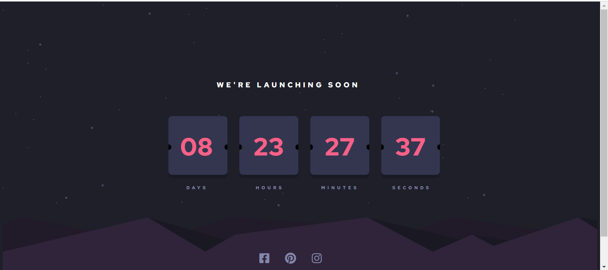
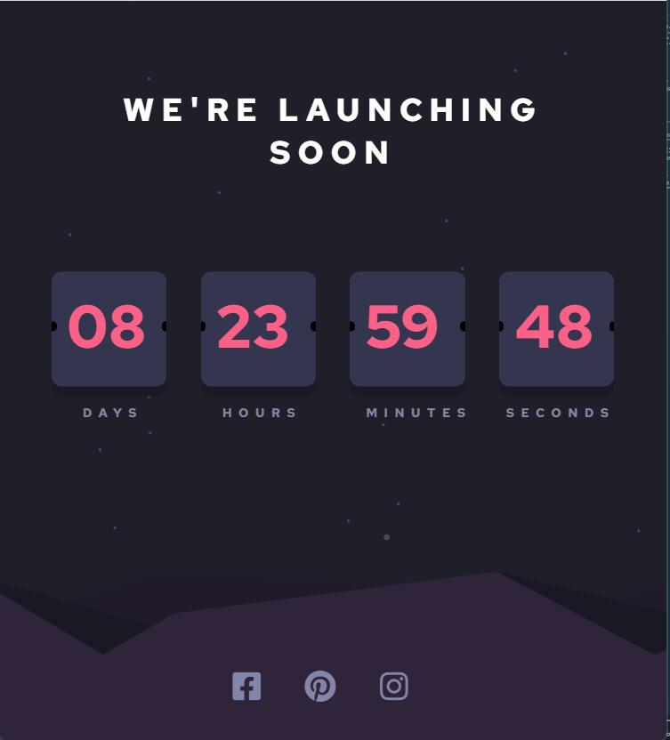

# Frontend Mentor - Launch countdown timer solution

This is a solution to the [Launch countdown timer challenge on Frontend Mentor](https://www.frontendmentor.io/challenges/launch-countdown-timer-N0XkGfyz-). Frontend Mentor challenges help you improve your coding skills by building realistic projects. 

## Table of contents

- [Overview](#overview)
  - [The challenge](#the-challenge)
  - [Screenshot](#screenshot)
- [My process](#my-process)
  - [Built with](#built-with)
  - [What I learned](#what-i-learned)
  - [Continued development](#continued-development)
- [Author](#author)
- [Acknowledgments](#acknowledgments)

**Note: Delete this note and update the table of contents based on what sections you keep.**

## Overview

### The challenge

Users should be able to:

- See hover states for all interactive elements on the page
- See a live countdown timer that ticks down every second (start the count at 9 days)

### Screenshot

## My process

### Built with

- Semantic HTML5 markup
- CSS custom properties
- Flexbox
- Mobile-first workflow

### What I learned

Working on this project I worked upon my knowledge on javascript and responsive styles. The project is simple and minimal but needs a lot of concentration while working a liitile mistake may lead to chaos.

### Continued development

Though the project wanted to add a flip animation on countdown everytime the time decreases I tried but could not understan so I will keep on working the animations and using different frameworks and functions in javascript to make many more interesting projects in javascript.

## Author

- Frontend Mentor - [@riya1511](https://www.frontendmentor.io/profile/riya1511)
- Twitter - [@riyarai1511](https://twitter.com/riyarai1511)

## Acknowledgments

Lastly, I would like to thank everyone who posts the solutions of all the problems I stuck upon. People really works hard and contribute to technology that is really motivating and want to grow with them and enhance my skills.
